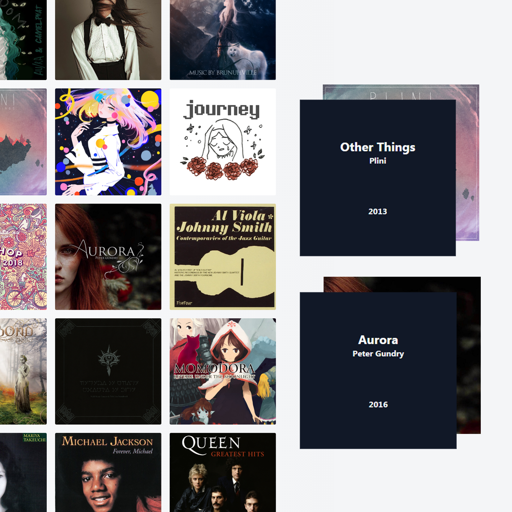
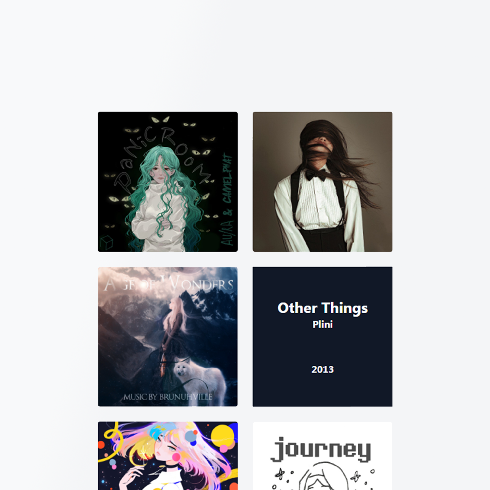

# Galeria com Álbuns Musicais Favoritos
Neste desafio, eu devo construír uma galeria que exiba meus álbuns favoritos, todos devem apresentar:
 - Nome do Álbum
 - Capa do Álbum
 - Artista
 - Ano de Lançamento

Para executar, basta abrir o arquivo **dist/index.html**

<p align="center">
    
    
</p>


## Notas:
- A capa referente ao álbum "Transmission of all the Goodbyes" foi customizada por mim.
- Nesta versão há uma forma de popular ainda mais a galeria: a função **addAlbum(item, parentElement)**
    ```javascript
    //Exemplo de uso
    let parent = document.getElementById("#gallery");
    let newAlbum = {
        name: "Name Of The Disc",
        year: "20XX",
        artist: "Name of the Artist",
        cover: "url-relative-to" //Este caminho é relativo a pasta 'img' deste projeto
    }
    addAlbum(newAlbum, parent);
    ```

## A Fazer: 
- [ ] Adicionar uma api para capturar a capa do álbum
- [ ] Adicionar um filtro para ordenar (alfabeticamente, por ano ou por artista)
