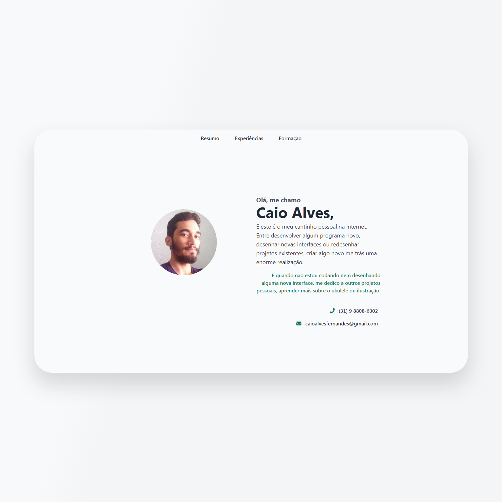
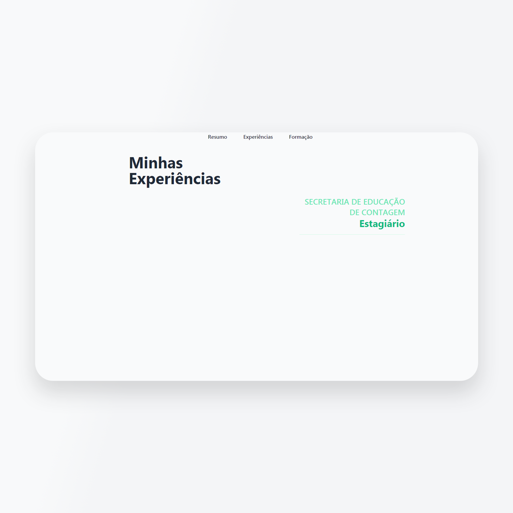

# Perfil/ Currículo Pessoal
Construir uma página que atuasse como uma página pessoal sobre mim, falando sobre minha formação e minhas atividades profissionais até o momento.

Para executar, basta abrir o arquivo **dist/index.html**

    
    

