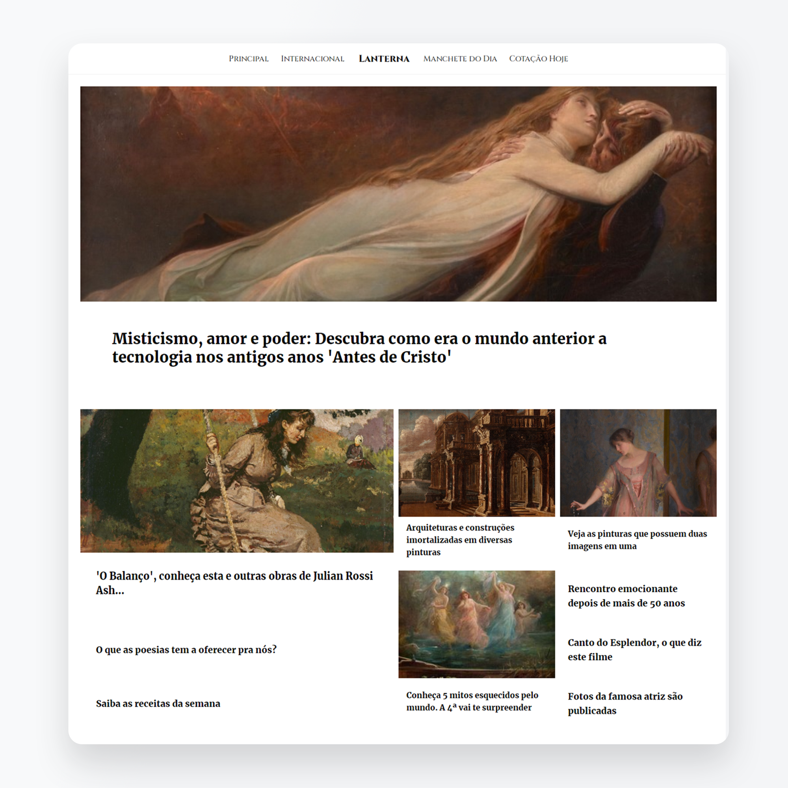
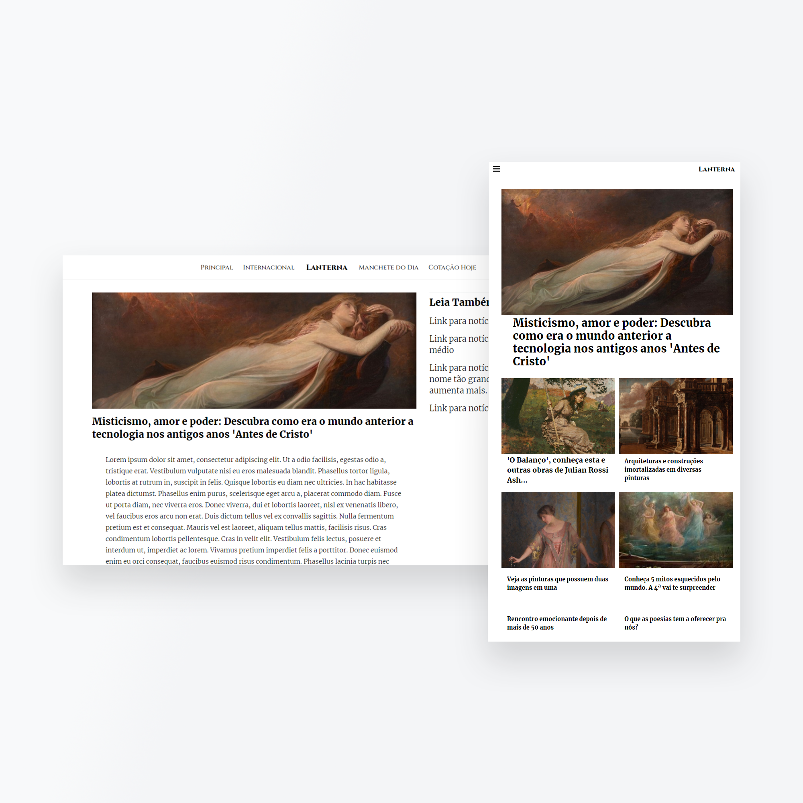

# Site de Notícias 'Lanterna'
<h2 align="center"><a href="https://ocai0.github.io/frontend-challenges/projects/noticias-lanterna/dist/">**Veja Agora**</a></h2>
Aqui o desafio era construír um layout de site de notícias de forma responsiva.
Para executar, basta abrir o arquivo **dist/index.html**

    
    

