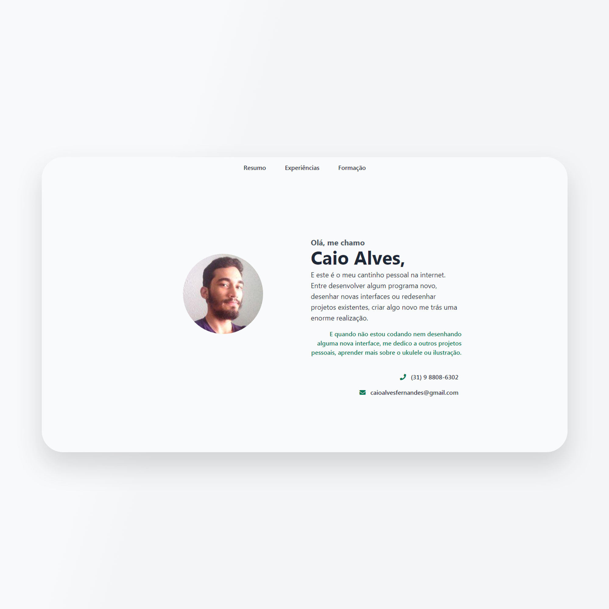
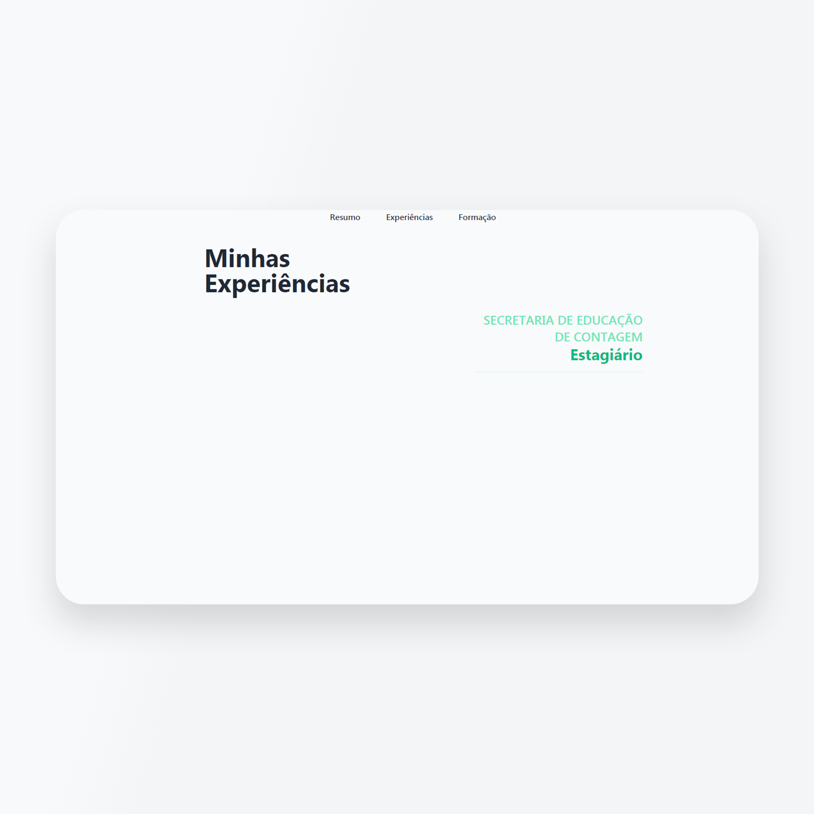

# Perfil/ Currículo Pessoal
<h2 align="center"><a href="https://ocai0.github.io/frontend-challenges/projects/perfil-curriculo/dist/">**Veja Agora**</a></h2>
Construir uma página que atuasse como uma página pessoal sobre mim, falando sobre minha formação e minhas atividades profissionais até o momento.

Para executar, basta abrir o arquivo **dist/index.html**

    
    

