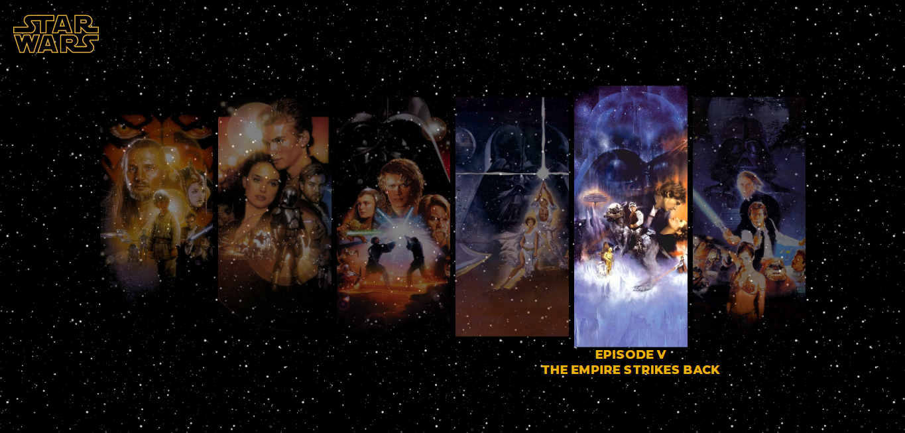
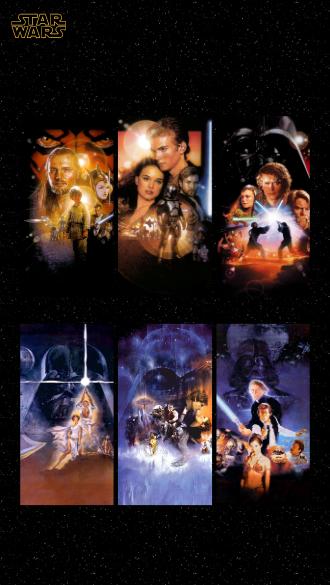

# Star Wars Poster UI Idea

    <h2 style="width: 100%; height: 100%; display: flex; align-items: center; justify-content: center">
        <a style="color: white" href="https://ocai0.github.io/frontend-challenges/star-wars-poster/dist/">See This Project LIVE NOW</a>
    </h2>

While i was watching [this video](https://www.youtube.com/watch?v=6mBxfiqQ3lQ) from the Brazilian Youtuber Felipe Castanhari, my attention got caughted by a [little UI](https://youtu.be/6mBxfiqQ3lQ?t=1502) showing all the Star Wars films of the first two trilogies (by the time this video was made, *Star Wars - The Force Awakens* hasn't been launched yet). And i thought it could be interesting to recreate this little UI with some React and TailwindCSS and it turns it out a very cool beginner exercise.

[You can see the final result here](https://ocai0.github.io/frontend-challenges/star-wars-poster/dist/), or you can look around the source code that i've done.

## Images

    
    

___

    
Well, that's about it, hope you enjoy and... 

    <h3 style="margin:0;"> May the force be with you!</h3>

